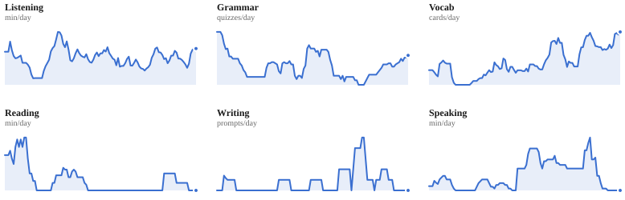
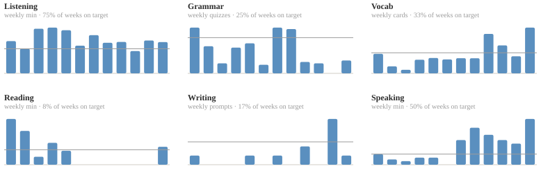
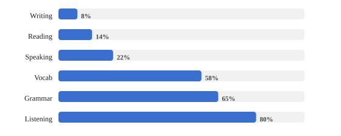

# Jimmy's French Habit Tracker

I log every French study session — listening, grammar, vocab, reading, writing,
speaking — in a Google Sheet. This repo reads that sheet and rebuilds the stats
below once a day, so the numbers stay current.

[**Live dashboard**](https://jimmysieja.github.io/french-habit-tracker/) — the
same data, interactive.

<!-- STATS:START -->

Updated 07 Sep 2026, 09:26 UTC &nbsp;·&nbsp; 98 days tracked &nbsp;·&nbsp; 01 Jun 2026 – 06 Sep 2026

| Current streak | Longest streak | Consistency | Total time |
|:-:|:-:|:-:|:-:|
| **21** days | **47** days | **96%** | **103** h |

## Study calendar

<picture>
  <source media="(prefers-color-scheme: dark)" srcset="assets/calendar-dark.svg">
  
</picture>
Darker = more time that day. Hover any day on the [live dashboard](https://jimmysieja.github.io/french-habit-tracker/) for the per-skill breakdown.

## By skill

| Skill | Total | Time | Days practised | Weeks on target |
|:--|--:|--:|--:|--:|
| Listening | 3,311 min | 55.2 h | 76 (78%) | 75% |
| Grammar | 216 quizzes | 18.0 h | 60 (61%) | 25% |
| Vocab | 5,670 cards | 7.9 h | 51 (52%) | 33% |
| Reading | 375 min | 6.2 h | 16 (16%) | 8% |
| Writing | 12 prompts | 5.0 h | 9 (9%) | 17% |
| Speaking | 635 min | 10.6 h | 26 (27%) | 50% |
| **Total** | | **103 h** | | |

## 7-day rolling trend

<picture>
  <source media="(prefers-color-scheme: dark)" srcset="assets/trend-dark.svg">
  
</picture>

## Weekly totals against objective

<picture>
  <source media="(prefers-color-scheme: dark)" srcset="assets/objectives-dark.svg">
  
</picture>

## Skill balance

<picture>
  <source media="(prefers-color-scheme: dark)" srcset="assets/skills-dark.svg">
  
</picture>
Bar = share of days practised. Tick = average weekly-objective attainment.

## Where the time goes

<picture>
  <source media="(prefers-color-scheme: dark)" srcset="assets/time-split-dark.svg">
  
</picture>

## Average minutes by day of week

<picture>
  <source media="(prefers-color-scheme: dark)" srcset="assets/weekday-dark.svg">
  
</picture>

## Last 7 days

| Skill | Last 7 days | vs. previous 7 |
|:--|--:|:--|
| Listening | 287 min | +25% |
| Grammar | 19 quizzes | +111% |
| Vocab | 558 cards | -44% |
| Reading | 20 min | -56% |
| Writing | 1 prompts | +0% |
| Speaking | 20 min | -85% |

Total time converts counts to minutes: vocab 5s/card · grammar 5min/lesson · writing 25min/prompt. 72 h of that is logged directly.

<!-- STATS:END -->

## What's tracked

A daily row per skill, in whatever unit is natural for it: minutes for
listening / reading / speaking, quizzes for grammar, cards for vocab, prompts for
writing. Weekly objectives sit alongside so I can see where I'm keeping pace and
where I'm slipping. The "estimated time on French" figure rolls the counts back
into minutes with rough conversion rates so all six skills compare on one axis.

## How it's built

`analytics.py` pulls the sheet with [gspread](https://docs.gspread.org/) and does
the maths (streaks, rolling trends, skill balance, objective attainment) in
pandas. `dashboard.py` draws every chart as hand-written SVG — no chart library —
and emits both a standalone `index.html` and the light/dark `.svg` files embedded
above. A GitHub Actions workflow runs `build.py` on a schedule, commits the
refreshed stats, and redeploys the dashboard to GitHub Pages.

Want to run your own copy? See **[SETUP.md](SETUP.md)**.

## License

MIT — see [LICENSE](LICENSE).
