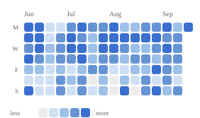
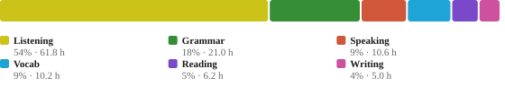
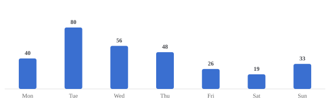

# 🇫🇷 Learning French, in public

I log every French study session — listening, grammar, vocab, reading, writing,
speaking — in a Google Sheet. This repo reads that sheet and rebuilds the stats
below **every few hours**, so the numbers here are always current.

<!-- STATS:START -->

_Auto-updated 28 Aug 2026, 03:27 UTC — covering 01 Jun 2026 → 27 Aug 2026._

    

### At a glance

| | |
|--|--|
| 🔥 Current streak | **11 days** (still going) |
| 🏆 Longest streak | **47 days** (01 Jun – 17 Jul) |
| 📆 Active days | **84 / 88** (95%) |
| ⏱ Estimated time on French | **~91 hours** (64 h logged directly) |

### 📅 Study calendar

<picture>
  <source media="(prefers-color-scheme: dark)" srcset="assets/calendar-dark.svg">
  
</picture>

### 📊 By skill

| Skill | Total | Est. time | Days practised | Weeks hit target |
|-------|------:|----------:|---------------:|-----------------:|
| Listening | 2,959 min | 49.3 h | 67 (76%) | 67% |
| Grammar | 197 quizzes | 16.4 h | 55 (62%) | 25% |
| Vocab | 4,878 cards | 6.8 h | 45 (51%) | 33% |
| Reading | 310 min | 5.2 h | 14 (16%) | 8% |
| Writing | 10 prompts | 4.2 h | 7 (8%) | 17% |
| Speaking | 545 min | 9.1 h | 22 (25%) | 42% |

### ⚖️ Where the time goes  ·  📆 By weekday

<picture>
  <source media="(prefers-color-scheme: dark)" srcset="assets/time-split-dark.svg">
  
</picture>

<picture>
  <source media="(prefers-color-scheme: dark)" srcset="assets/weekday-dark.svg">
  
</picture>

### 🚀 Last 7 days

| Skill | Last 7 days | vs. previous 7 |
|-------|------------:|:--------------|
| Listening | 290 min | ▲ +100% |
| Grammar | 9 quizzes | — |
| Vocab | 768 cards | ▲ +72% |
| Reading | 0 min | — |
| Writing | 1 prompts | ▼ -75% |
| Speaking | 60 min | ▲ +0% |

Estimated time converts counts to minutes: vocab 5s/card, grammar 5min/lesson, writing 25min/prompt.

<!-- STATS:END -->

## What's tracked

A daily row per skill, in whatever unit is natural for it: minutes for
listening / reading / speaking, quizzes for grammar, cards for vocab, prompts for
writing. Weekly objectives sit alongside so I can see where I'm keeping pace and
where I'm slipping. The "estimated time on French" figure rolls the counts back
into minutes with rough conversion rates so all six skills compare on one axis.

## How it's built

`analytics.py` pulls the sheet with [gspread](https://docs.gspread.org/) and does
the maths (streaks, rolling trends, skill balance, objective attainment) in
pandas. `dashboard.py` draws every chart as hand-written SVG — no chart library —
and emits both a standalone `index.html` and the light/dark `.svg` files embedded
above. A GitHub Actions workflow runs `build.py` on a schedule, commits the
refreshed stats, and redeploys the dashboard to GitHub Pages.

Want to run your own copy? See **[SETUP.md](SETUP.md)**.

## License

MIT — see [LICENSE](LICENSE).
