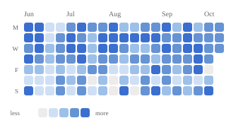
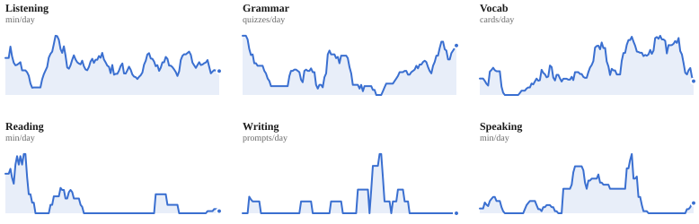
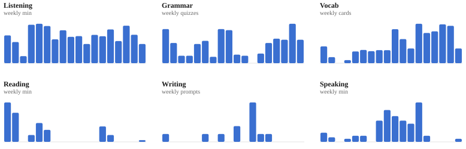
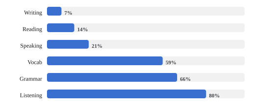
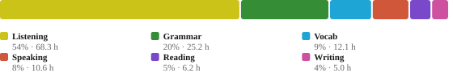
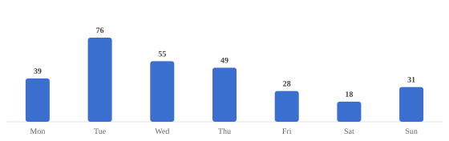

# Jimmy's French Habit Tracker

I log every French study session — listening, grammar, vocab, reading, writing,
speaking — in a Google Sheet. This repo reads that sheet and rebuilds the stats
below once a day, so the numbers stay current.

[**Live dashboard**](https://jimmysieja.github.io/french-habit-tracker/) — the
same data, interactive.

<!-- STATS:START -->

Updated 05 Oct 2026, 11:35 UTC &nbsp;·&nbsp; 126 days tracked &nbsp;·&nbsp; 01 Jun 2026 – 04 Oct 2026

| Consistency | Total time | Median weekly time | Last 7 days | Last 30 days |
|:-:|:-:|:-:|:-:|:-:|
| **96%** | **133** h | **8.2** h | **6.9** h | **31.4** h |

## Study calendar

<picture>
  <source media="(prefers-color-scheme: dark)" srcset="assets/calendar-dark.svg">
  
</picture>
Darker = more time that day. Hover any day on the [live dashboard](https://jimmysieja.github.io/french-habit-tracker/) for the per-skill breakdown.

## By skill

| Skill | Total | Time | Days practiced |
|:--|--:|--:|--:|
| Listening | 4,258 min | 71.0 h | 101 (80%) |
| Grammar | 331 quizzes | 27.6 h | 82 (65%) |
| Vocab | 9,003 cards | 12.5 h | 73 (58%) |
| Reading | 385 min | 6.4 h | 18 (14%) |
| Writing | 12 prompts | 5.0 h | 9 (7%) |
| Speaking | 645 min | 10.8 h | 27 (21%) |
| **Total** | | **133 h** | |

## 7-day rolling trend

<picture>
  <source media="(prefers-color-scheme: dark)" srcset="assets/trend-dark.svg">
  
</picture>

## Weekly totals

<picture>
  <source media="(prefers-color-scheme: dark)" srcset="assets/weekly-dark.svg">
  
</picture>

## Skill balance

<picture>
  <source media="(prefers-color-scheme: dark)" srcset="assets/skills-dark.svg">
  
</picture>
Bar = share of days practiced.

## Where the time goes

<picture>
  <source media="(prefers-color-scheme: dark)" srcset="assets/time-split-dark.svg">
  
</picture>

## Average minutes by day of week

<picture>
  <source media="(prefers-color-scheme: dark)" srcset="assets/weekday-dark.svg">
  
</picture>

## Last 7 days

| Skill | Last 7 days |
|:--|--:|
| Listening | 198 min |
| Grammar | 33 quizzes |
| Vocab | 375 cards |
| Reading | 10 min |
| Writing | 0 prompts |
| Speaking | 10 min |

Total time converts counts to minutes: vocab 5s/card · grammar 5min/lesson · writing 25min/prompt. 88 h of that is logged directly.

<!-- STATS:END -->

## What's tracked

A daily row per skill, in whatever unit is natural for it: minutes for
listening / reading / speaking, quizzes for grammar, cards for vocab, prompts for
writing. The "estimated time on French" figure rolls the counts back into minutes
with rough conversion rates so all six skills compare on one axis.

## How it's built

`analytics.py` pulls the sheet with [gspread](https://docs.gspread.org/) and does
the maths (streaks, rolling trends, skill balance) in pandas. `dashboard.py` draws every chart as hand-written SVG — no chart library —
and emits both a standalone `index.html` and the light/dark `.svg` files embedded
above. A GitHub Actions workflow runs `build.py` on a schedule, commits the
refreshed stats, and redeploys the dashboard to GitHub Pages.

Want to run your own copy? See **[SETUP.md](SETUP.md)**.

## License

MIT — see [LICENSE](LICENSE).
